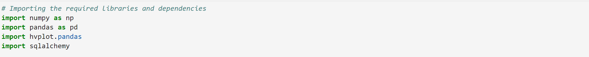
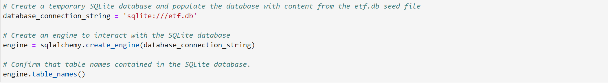
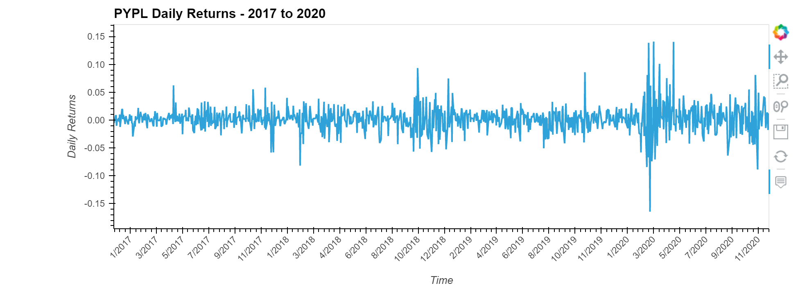
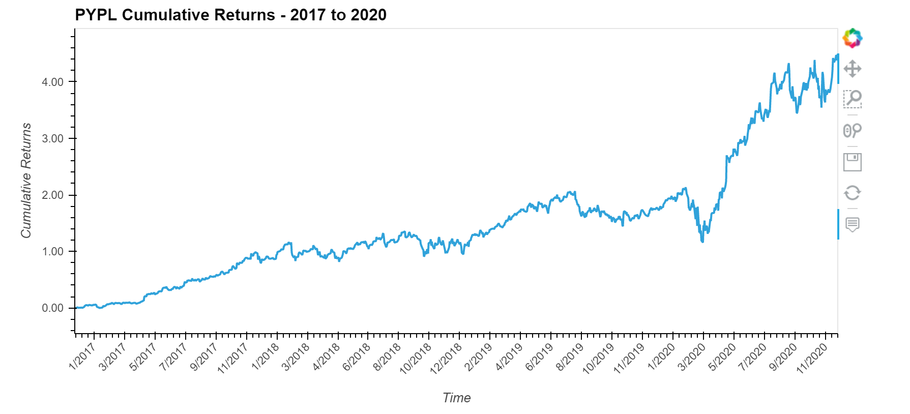
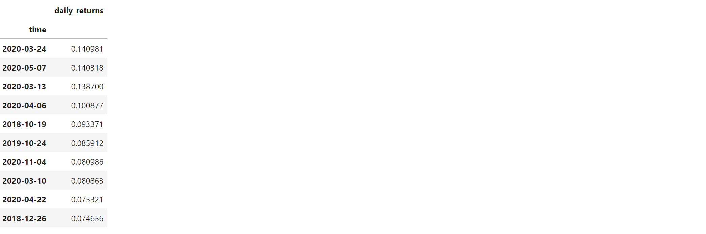
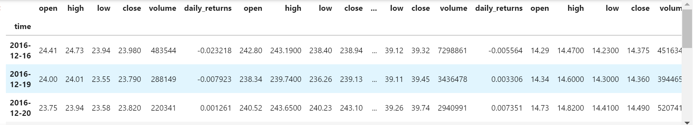
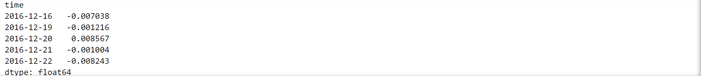
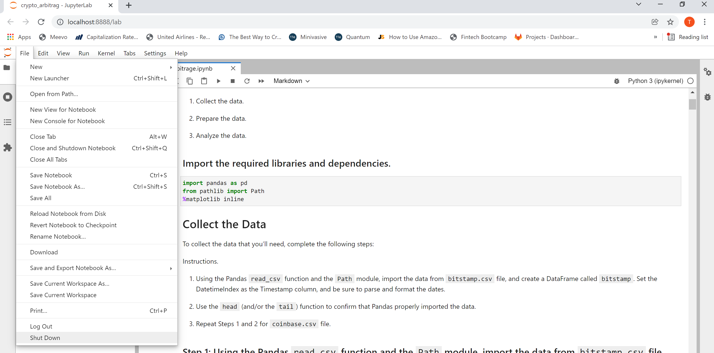

# Fintech ETF Analyzer
The purpose of this challenge is to build a financial database and web application by using SQL, Python, and the Voilà library to analyze the performance of a hypothetical fintech ETF. The fintech ETF is comprised of the following four stocks: GDOT, GS, PYPL, and SQ.


---

## Technologies

The financial planner leverages Python 3.8+ and utilizes the following project libraries and dependencies:
* [JupyterLab](https://jupyterlab.readthedocs.io/en/stable/) - a single integrated development environment (IDE) that allows you to write and run Python programs and review the results in one place
* [Pandas](https://pandas.pydata.org/) - a software library designed for open source data analysis and manipulation
* SQLAlchemy 
* Voila
* hvplot


---

## Installation Guide


Download Anaconda for your operating system and the latest Python version, run the installer, and follow the steps. Restart the terminal after completing the installation. Detailed instructions on how to install Anaconda can be found in the [Anaconda documentation](https://docs.anaconda.com/anaconda/install/).

Install SQLAlchemy

SQLAlchemy is an open-source SQL library for Python.

To install this library, run the following command in your terminal:

```python
pip install SQLAlchemy
```

Install Voila

With Voilà, a Python library, you can convert a Jupyter notebook into a live webpage.

To install Voilà, open a terminal window, and then complete the following steps:

Activate your Conda dev environment.

Run the following command:

```python
conda install -c conda-forge voila
```
---

## Usage
The analysis is hosted on the following GitHub repository at: https://github.com/nguyenthuyt/etf_analyzer   

### **Run instructions:**
To run this analysis, simply clone the repository or download the files and launch the **etf_analyzer.ipynb** in JupyterLab

To launch JupyterLab, follow these steps:

In your open terminal window (Terminal for macOS or Git Bash for Windows), navigate (`CD`) to the repo directory and then confirm that the term (dev) appears at the beginning of your command prompt. Type:
```python
conda activate dev
```

Then type: 
```python
jupyter lab
```

An instance of the JupyterLab user interface automatically opens in your browser. On the left-hand side menu, double-click the **etf_analyzer.ipynb** file to open the notebook.

Navigate to **'Run'** on the menu bar and select **'Run All Cells'** from the drop-down menu. Otherwise, run each individual cell with ctrl+enter.


If running each cell individually, first run the cell to import the required libraries and dependencies: 




### **Step 1: Import the data**
Before using, it is required to load market data. In this analysis market data is loaded by creating an engine to a temporary SQLite database populated with the data from 'etf.db' stored in the main repository folder. To import the data, type:




To confirm the data was imported properly, use the head and/or tail function to review the data:

`display(df.head())`

`display(df.tail())`

----

### **Step 2: Analyze a single asset in the Fintech ETF**

In this section, you will utilize SQL queries with Python, Pandas and hvplot to analyze the single performance of a single asset from the ETF. Complete the following:

(1) Write a SQL SELECT statement by using an f-string that reads all the PYPL data from the database. Using the SQL SELECT statement, execute a query that reads the PYPL data from the database into a Pandas DataFrame.

```python
query = """
SELECT * FROM PYPL
"""
pypl_dataframe = pd.read_sql_query(query, con=engine, parse_dates=["time"], index_col=["time"])
```


(2) Using hvPlot, create an interactive visualization for the daily returns and cumulative returns



(3) Using SQL, access the closing prices greater than 200.0 and find the top 10 daily returns:
```python
"""
SELECT time, close
FROM PYPL
WHERE close > 200.0;
"""

"""
SELECT time, daily_returns
FROM PYPL
ORDER BY daily_returns DESC
LIMIT 10;
"""
```



### **Step 3: Analyze the Fintech Portfolio**

In this step, you’ll build the entire ETF portfolio and then evaluate its performance. To do so, you’ll build the ETF portfolio by using SQL joins to combine all the data for each asset.

(1) Write a SQL query to join each table in the portfolio into a single DataFrame. To do so, complete the following steps:

```python
"""
SELECT 
    GDOT.time, GDOT.open, GDOT.high, GDOT.low, GDOT.close, GDOT.volume, GDOT.daily_returns,
    GS.open, GS.high, GS.low, GS.close, GS.volume, GS.daily_returns,
    PYPL.open, PYPL.high, PYPL.low, PYPL.close, PYPL.volume, PYPL.daily_returns,
    SQ.open, SQ.high, SQ.low, SQ.close, SQ.volume, SQ.daily_returns
FROM GDOT
INNER JOIN GS ON GDOT.time = GS.time
INNER JOIN PYPL ON GDOT.time = PYPL.time
INNER JOIN SQ ON GDOT.time = SQ.time;
"""
```


(2) For the ETF portfolio, calculate average daily returns, annualized return value, and cumulative returns.




(3) Using hvplot, create an interactive line plot that visualizes the cumulative return values of the ETF portfolio.


### **Step 4: Deploy the Notebook as a Web Application**
Use the Voilà library to deploy your notebook as a web application. 


### **Quit instructions:**
After saving the file, from the menu bar, navigate to **'File'**, select **'Shutdown'** from the drop-down menu and confirm Shut Down.




In your open terminal window, deactivate the dev environment by typing:
```python
conda deactivate
```

---

## Contributors

This project was created as part of the Rice Fintech Bootcamp 2022 Program by:

Thuy Nguyen

Email: nguyen_thuyt@yahoo.com

LinkedIn: nguyenthuyt


---

## License

MIT
